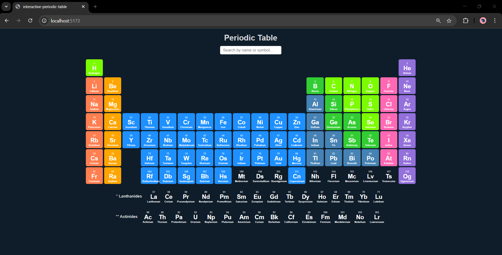
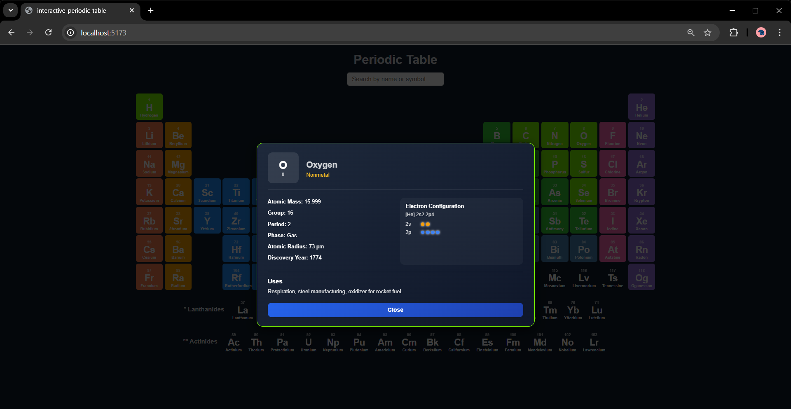

# Interactive Periodic Table

An **interactive and visually engaging periodic table** built with **React and Vite**, allowing users to explore chemical elements, their properties, and detailed information in a seamless, responsive interface.

---

## Features

- Click on any element to see detailed properties in a modal  
- Search and filter elements by **name** and **symbol**  
- Fully responsive for **mobile and desktop** screens  
- Clean UI built with **CSS Modules**  
- Fast development with **React + Vite (HMR)**  

---

## Screenshots

### Periodic Table


### Element Details Modal


---

## Tech Stack

- React  
- Vite  
- JavaScript (ES6+)  
- CSS Modules  

---

## Future Enhancements

- Element category-based filtering  
- Dark / Light mode  
- More detailed element data  

---

## Installation / Run Locally

1. Clone the repository:

```bash
git clone https://github.com/YourUsername/interactive-periodic-table.git
